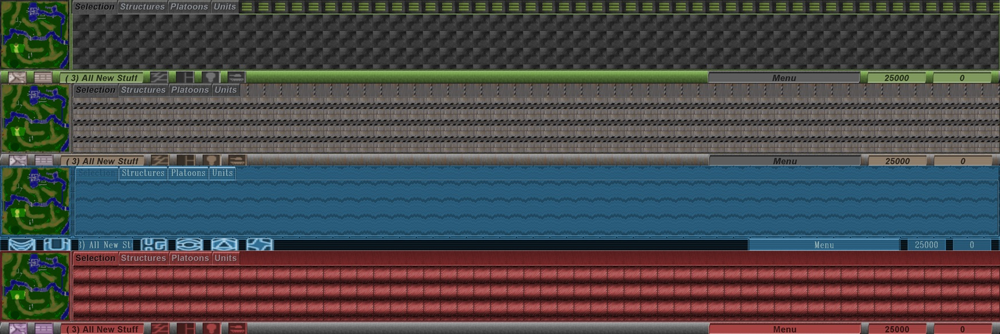

## Installation

1. For WD Files, simply create a new folder in the root of the game directory called "CustomWDFiles" and place them in there.

```
└── ~/
    ├── The Moon Project/
    │    ├── CustomWDFiles
    │    │    ├── Interface001.wd
    │    │    ├── Interface002.wd
    │    │    ├── ...
```

## Examples:

